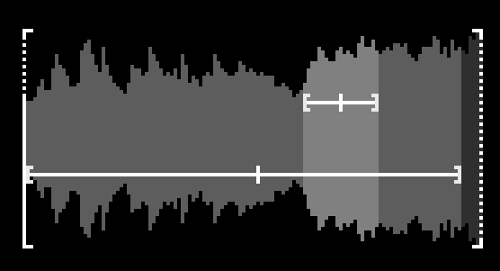
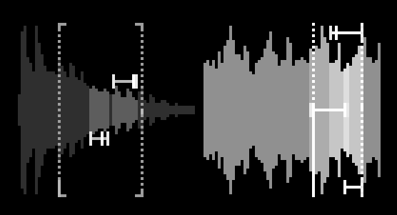
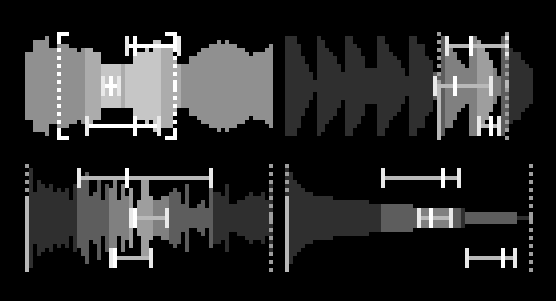
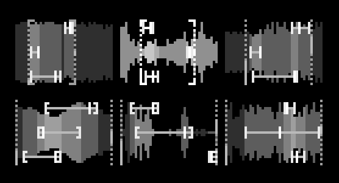

# grains

A six-voice granular sample player for [monome norns](https://monome.org/docs/norns/).

Point it at a folder of samples and it loads up to six voices, each running several playback heads that drift and collide inside the boundaries you set. So a patch keeps moving on its own without ever repeating exactly - somewhere between a drone, a tape loop, and a chord that never quite settles. Tweak every parameter manually, or just use randomization. Really quick and fun way to explore soundscapes. 

Included effects: reverb, delay, shimmer, chorus, tape, glitch, wavefolder, bitcrusher, resonator, and more. You can morph between two states manually or with LFOs and there's a seamless loop recorder. Everything is controllable from the norns keys and encoders, no extra hardware needed.

It is under development, so things might change. :)

Inspired by and based on [Graintopia](https://github.com/schollz/graintopia).


<table>
  <tr>
    <td></td>
    <td></td>
  </tr>
  <tr>
    <td></td>
    <td></td>
  </tr>
</table>

## requires

- norns (or norns shield)

## install

From maiden:

```
;install https://github.com/danielrigler/grains
```

Do not forget to restart. 

## controls

**Start here:** `K1+E1` sets Density - how many layers are spread across the loaded voices. At zero you hear nothing.
`K1+K2` fills the voices with random files from your audio folder. Or set a specific folder under `PARAMS > SOURCE`. 

**Encoders**

| | |
| --- | --- |
| `E1` | Master Volume |
| `E2` / `E3` | Set Boundaries (start / width) on the selected voice |
| `K1+E1` | Density |
| `K1+E2` | Add/Remove Layers |
| `K1+E3` | Add/Remove Voices |
| `K1+K3+E1` | Change Energy |
| `K1+K3+E2` | Morph LFO Depth |
| `K1+K3+E3` | Morph LFO Rate |
| `K2+E1` | Shuffle Volumes |
| `K2+E2` / `K2+E3` | Selected Volume / Other Volumes |
| `K3+E1` | Shuffle Pitches |
| `K3+E2` / `K3+E3` | Selected Pitch / Other Pitches |
| `K1+K2+E1` | Tilt EQ |
| `K1+K2+E2` / `K1+K2+E3` | HPF / LPF |
| `K2+K3+E1/E2/E3` | Reverb / Delay / Shimmer Mix |

**Keys**

| | |
| --- | --- |
| `K2` / `K3` | Navigate Voices |
| `K1+K2` | Load Random Audio |
| `K2+K3` | Lock Selected Voice |
| `K1+K2+K3` | Reseed Voices |
| `K1` hold | Morph Toggle |
| `K1+K2` hold | Freeze Voice |
| `K1+K3` hold | Freeze All |


## notes

Voices take fewer layers each as you load more files (14 for one voice, 10 for two voices, 6 for three, 5 for four, 4 for five and six).
Long files are sliced: *Slice Length* under SOURCE decides how much is taken, from a random position in the file.
Loop recording saves a seamless loop to `dust/audio/grains/`.

## credits

- grains by @dddstudio
- inspired by and based on [Graintopia](https://github.com/schollz/graintopia) by @infinitedigits